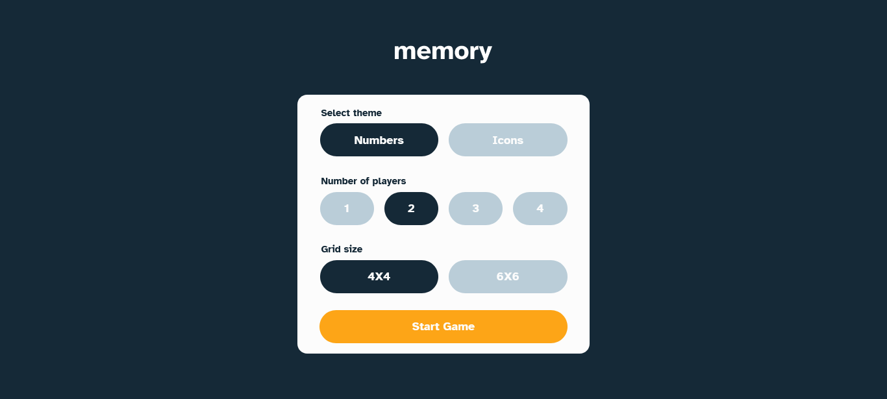

# Frontend Mentor - Memory game solution

This is a solution to the [Memory game challenge on Frontend Mentor](https://www.frontendmentor.io/challenges/memory-game-vse4WFPvM). Frontend Mentor challenges help you improve your coding skills by building realistic projects. 

## Table of contents

- [Overview](#overview)
  - [The challenge](#the-challenge)
  - [Screenshot](#screenshot)
  - [Links](#links)
- [My process](#my-process)
  - [Built with](#built-with)
  - [What I learned](#what-i-learned)
  - [Continued development](#continued-development)
  - [Useful resources](#useful-resources)
- [Author](#author)
- [Acknowledgments](#acknowledgments)

## Overview

### The challenge

Users should be able to:

- View the optimal layout for the game depending on their device's screen size
- See hover states for all interactive elements on the page
- Play the Memory game either solo or multiplayer (up to 4 players)
- Set the theme to use numbers or icons within the tiles
- Choose to play on either a 6x6 or 4x4 grid

### Screenshot




### Links

- Solution URL: [Add solution URL here](https://your-solution-url.com)
- Live Site URL: [Live preview link](https://chamumutezva.github.io/NumberMemoryGame/)

## My process

### Built with

- Semantic HTML5 markup
- CSS custom properties
- Flexbox
- CSS Grid
- Mobile-first workflow
- tab trapping
- utility classes

### What I learned

}
```
```js
function shuffle(array) {
    let currentIndex = array.length,
        temporaryValue, randomIndex;

    // While there remain elements to shuffle...
    while (currentIndex !== 0) {

        // Pick a remaining element...
        randomIndex = Math.floor(Math.random() * currentIndex);
        currentIndex -= 1;

        // And swap it with the current element.
        temporaryValue = array[currentIndex];
        array[currentIndex] = array[randomIndex];
        array[randomIndex] = temporaryValue;
    }

    return array;
};

```


### Continued development


### Useful resources

- [Tab trapping in a modal](https://uxdesign.cc/how-to-trap-focus-inside-modal-to-make-it-ada-compliant-6a50f9a70700) - the tab focus was disappearing and most of the times could not locate as it wasn't in view. This was caused by having modal dialogues which opens and close
- [Shuffle function](http://stackoverflow.com/a/2450976) - This is an amazing article that has an algorithm to randomly shuffle elemnts

## Author

- Website - [Chamu Mutezva](https://github.com/ChamuMutezva)
- Frontend Mentor - [@ChamuMutezva](https://www.frontendmentor.io/profile/ChamuMutezva)
- Twitter - [@ChamuMutezva](https://twitter.com/ChamuMutezva)


## Acknowledgments

Frontend Mentor